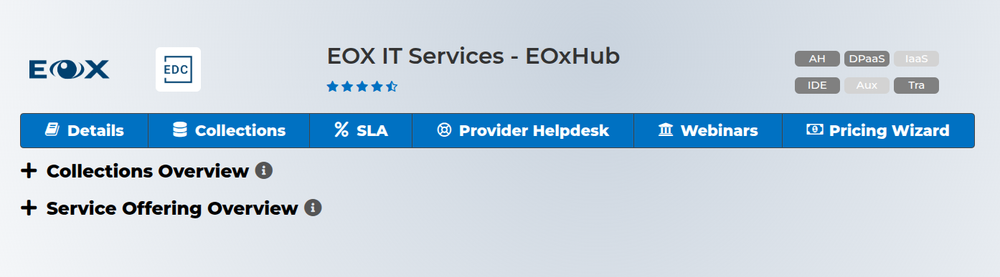
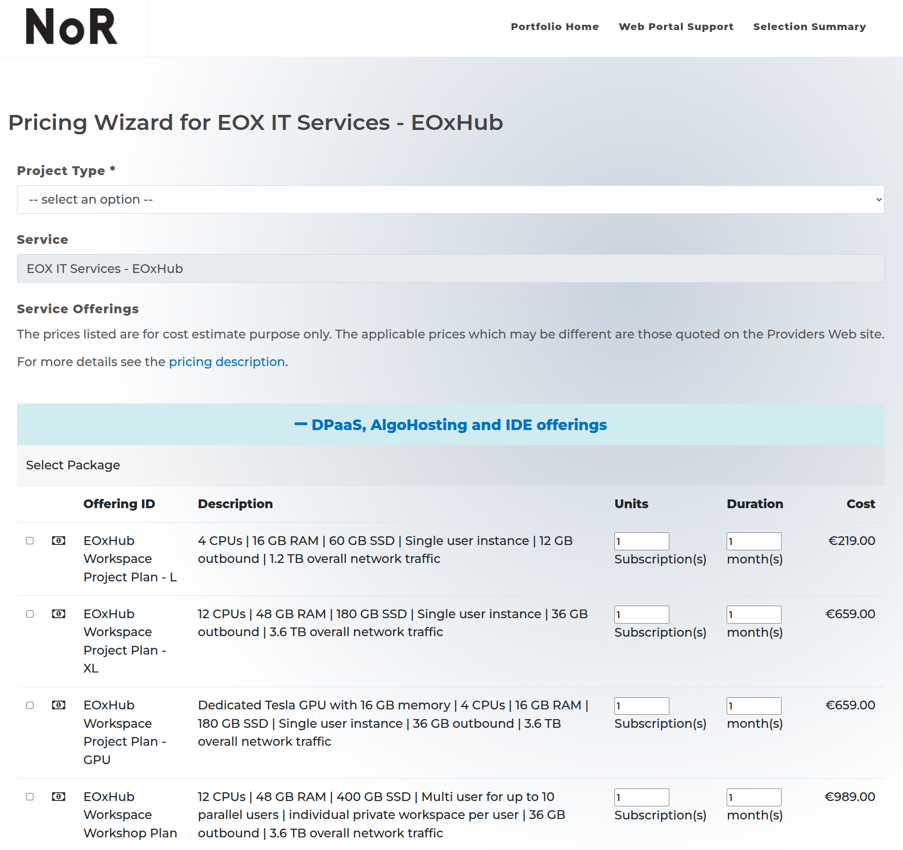

# Network of Resources

## Get ESA Sponsoring

You can access some of EOxHub Workspaces, API services, and data resources via ESA sponsoring from the Network of Resources (NoR). The NoR will provide successful applicants with a voucher for the selected services, allowing free-at-point-of-use consumption for research, product development, and up to pre-commercial demonstration.

## Procedure

The most straightforward process is via the Network of resources Discovery Portal. You can check yourself which Euro Data Cube/EOxHub resources are currently available for sponsoring at https://nor-discover.org/.

\

\
Follow the step by step process via the corresponding Pricing Wizard. When done, export the proposal in PDF, sign it and email it to ESA.

\

\
You can always contact us via the [EOxHub website](hub.eox.at) to ask for support with requesting the right sponsorship for your project.

As additional (optional) step you can follow the Euro Data Cube check-out process to request preview functionality for immediate use (e.g. via a Promotional Free Plan) until your sponsoring request is confirmed.
