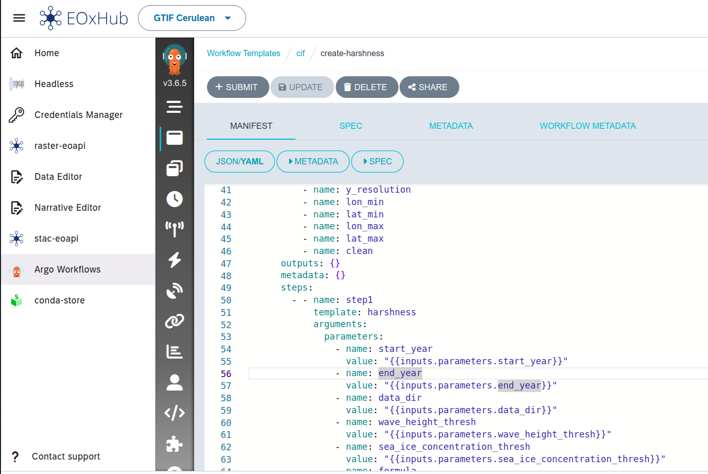
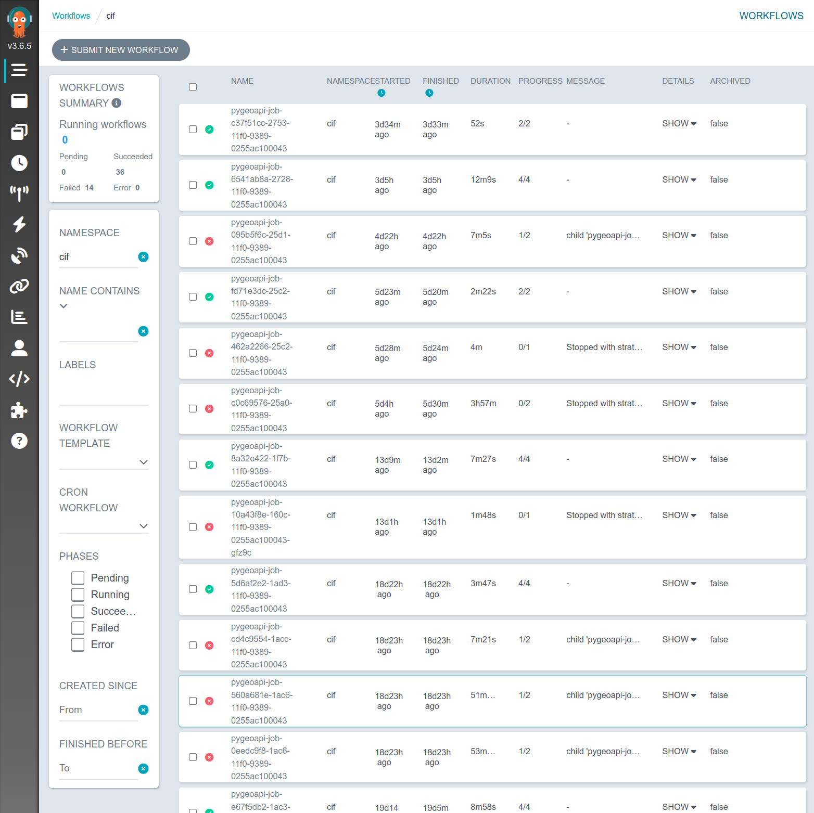
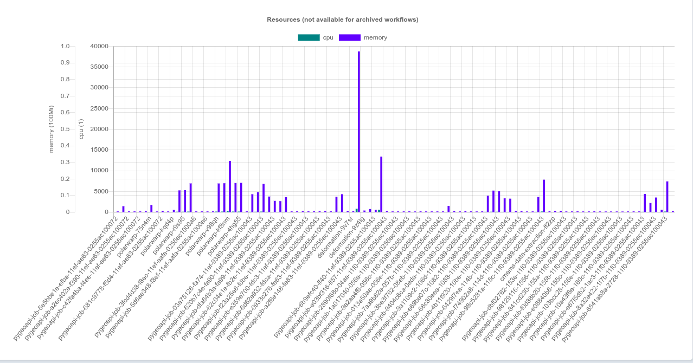

# Argo

EOxHub uses [Argo Workflows](https://argoproj.github.io/workflows/) as its workflow orchestration tool, providing a solution for executing multi-step processing pipelines where each step runs in its own container.

This enables scalable and repeatable execution of applications, supporting both simple tasks and complex, long-running jobs.

A web-based workflow editor is included, offering operators an intuitive interface to design, manage, and visualize workflows.

Argo Workflow Templates input mapping in web editor

Applications are published in the platform as Docker images, which can be versioned and reused across different workflows. Argo’s native support for dynamic parameter passing and conditional logic enables the creation of modular pipelines.

In addition to on-demand execution, workflows can be scheduled for automated, repeated execution using cron triggers.

Argo Workflow server

Argo Workflow Server built in resource usage metrics
