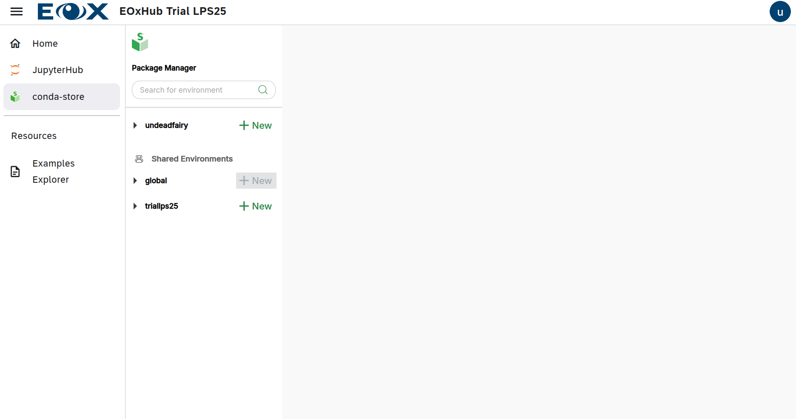
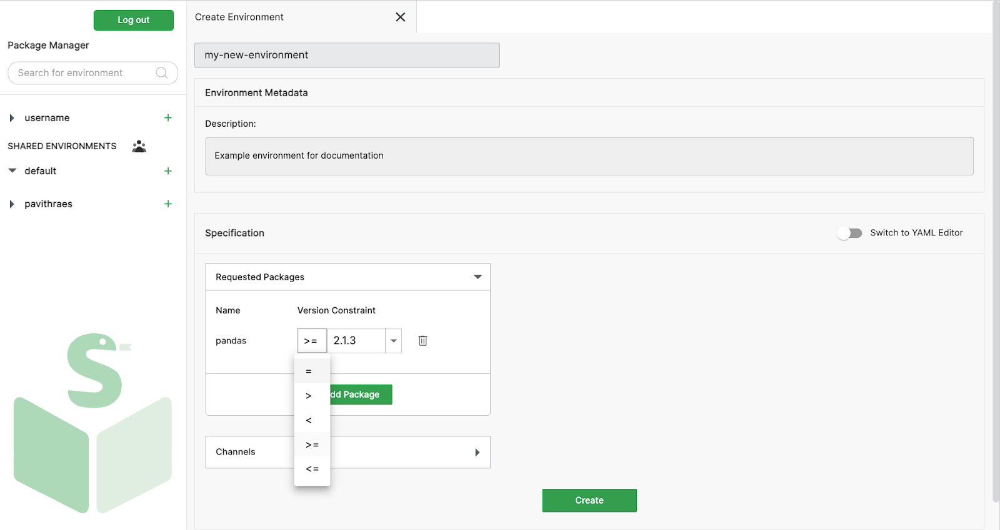

# Conda Store

Within each user workspace where JupyterLab is provisioned also a dedicated [Conda Store](https://conda.store/) is available.

```{note} Like any other application Conda Store might not be available in your EOxHub Workspace. Contact your workspace admin to change this.
```

Conda Store enables users to define and manage reproducible Python environments. This ensures consistent execution across sessions and allows developers to control the underlying libraries and dependencies for their workflows.


Conda store User interface

Dedicated environments can be produced based on the user rights either for a user themselves or for a whole workspace and shared with colleagues or other people.

Conda Store supports GUI or yaml syntax for environment creation and examples and how to guides can be found in the official [documentation](https://docs.conda.io/projects/conda/en/latest/user-guide/tasks/manage-environments.html)





