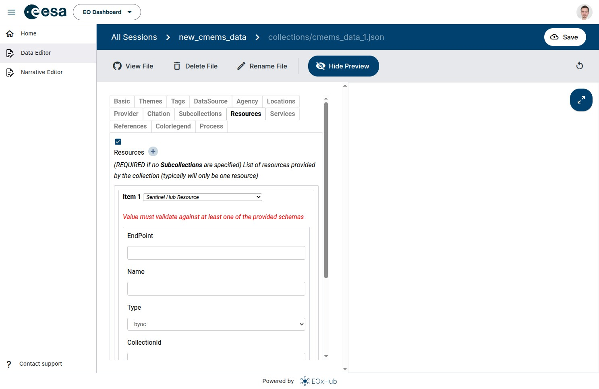

# Data Editor

Data Editor application, provides a traceable review and approval path of collection configurations before data is published to [eodash](https://eodash.org) STAC catalog.
It is based on [git-clerk](https://github.com/EOX-A/git-clerk) - Open-Source Content Management System based on Git workflows with a friendly file-editing GUI.

It enables workspace owners to describe their datasets using simple forms, validate them against JSON schema definitions, and commit them via Git-based sessions.


Data Editor collaborative publishing diagram 1
```{mermaid}
flowchart LR
  A[User <br> Git Clerk UI] --> B[Create Session]
  B --> C[Write Narrative<br/>in Online Editor]
  C --> D[Integrate <br> Maps <br> Charts]
  D --> E[Preview <br> Draft Content]
  E --> F{Is Content Ready?}
  F -- No --> C
  F -- Yes --> G[Submit]
style A fill:#f9f,stroke:#333,stroke-width:2px
```

Data Editor collaborative publishing diagram 2
```{mermaid}
flowchart LR
  G[Submit] --> H[Manager <br> Reviews PR]
  H --> I{Approve or Request Changes?}
  I -- Request Changes --> C[Write Narrative<br/>in Online Editor]
  I -- Approve --> J[Merge Pull Request]
  J --> K[Narrative Added to Catalog<br/>via GitHub Actions]
  G --> L[Public Preview Link Available]
  L --> M[Share with 3rd Party for Feedback]
  M --> G

style K fill:#bbf,stroke:#333,stroke-width:2px
```


Data Editor schema validation for a new collection

For a more hands-on tutorial on how to publish insights by exposing data and creating a narrative, see chapter [**Publish Insights**](../use_cases/publish_insights.md)
[A reference to a header](#targeting-headers).
