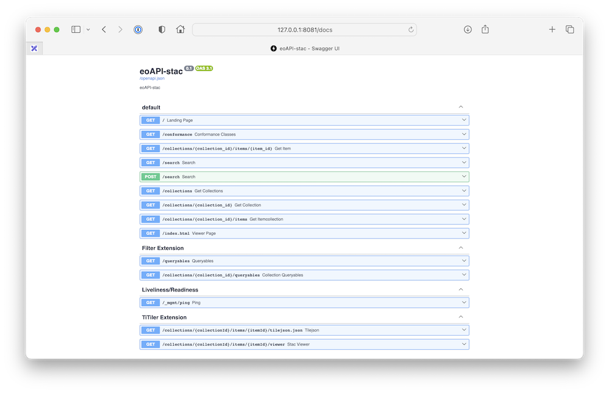
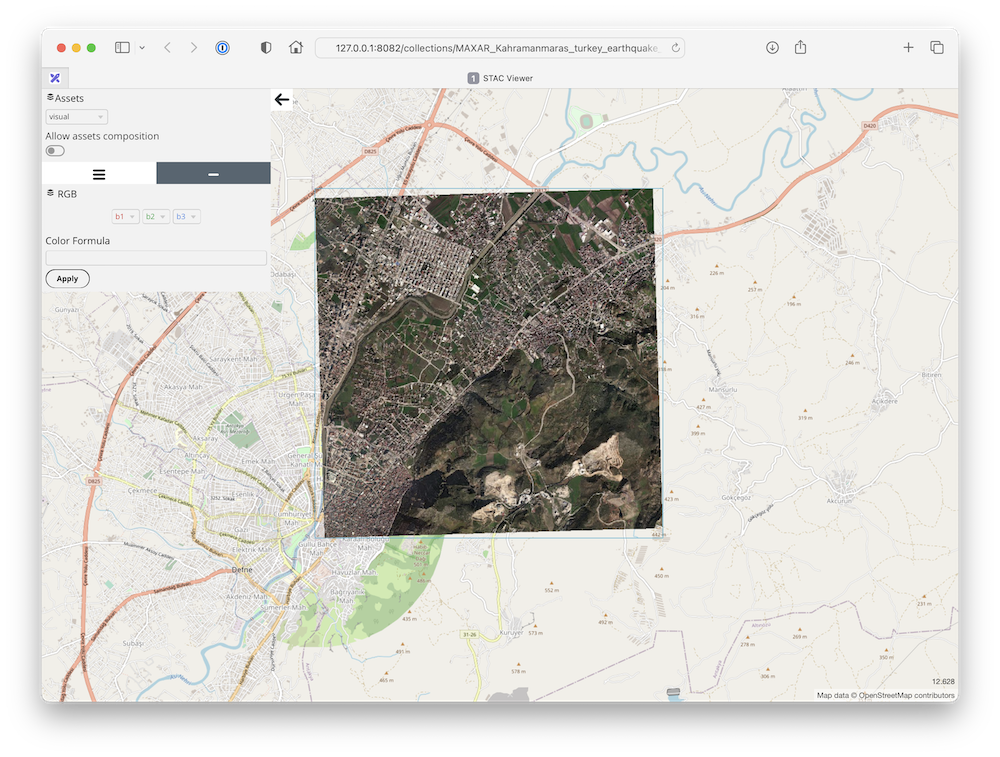
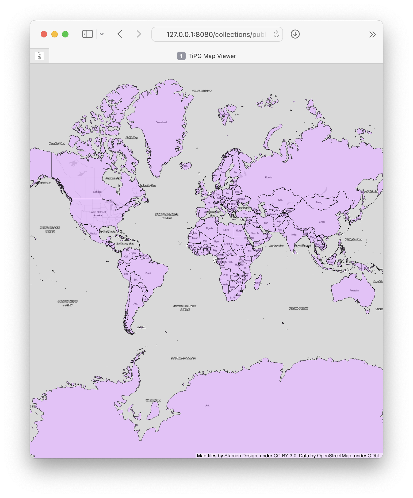

# eoAPI

EOxHub includes robust data visualization capabilities for both raster and vector data based primarily on [eoapi](https://eoapi.dev/). These are powered by [titiler-pgstac](https://github.com/stac-utils/titiler-pgstac) and [PgSTAC](https://github.com/stac-utils/pgstac), which together enable dynamic tiling and rendering of STAC-compliant assets directly from storage based on pre-defined collection-level metadata fields.

It exposes a [FastAPI](https://fastapi.tiangolo.com/) based interface, supporting image formats such as PNG and JPEG, and standard interfaces like WMTS.

## Functionality

### Catalog Your Data

[PgSTAC](https://github.com/stac-utils/pgstac) is an optimized Postgres schema to index and search large-scale STAC collections.

Ingesting the existing STAC items to the database can be done in multiple ways:

- Manually via [pypgstac](https://stac-utils.github.io/pgstac/pypgstac/) as `pypgstac load items`
- Manually if [transaction extension](https://github.com/stac-api-extensions/transaction?tab=readme-ov-file#methods) is enabled, then STAC data can be pushed to the API endpoint directly using POST/PUT requests.

### Make it Searchable

This service utilizes `stac-fastapi` to publish and manage metadata describing their datasets, enabling machine-readable search, query, filter and cataloging across collections.

### Visualize Raster Data

titiler-pgSTAC is a TiTiler extension that connects to pgSTAC to support large-scale dynamic mosaic tiling for visualizing STAC collections and items.

### Visualize Vector Data

Utilizing [tipg](https://github.com/developmentseed/tipg) - Vector Tiling Service  for OGC Features and OGC Tiles specifications.

