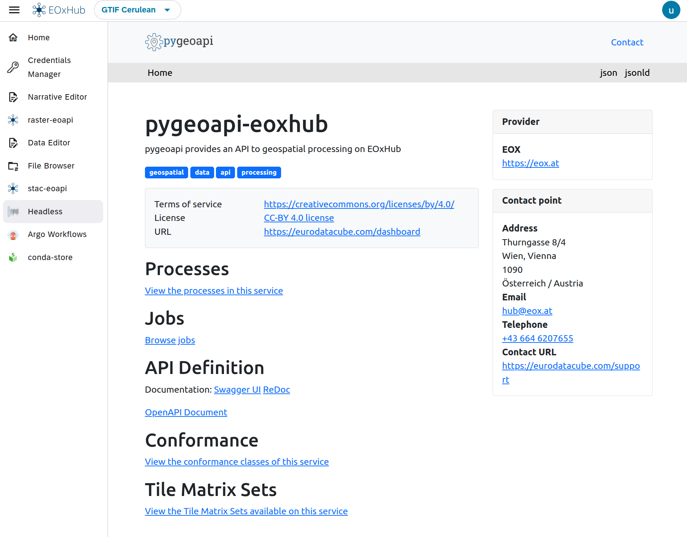
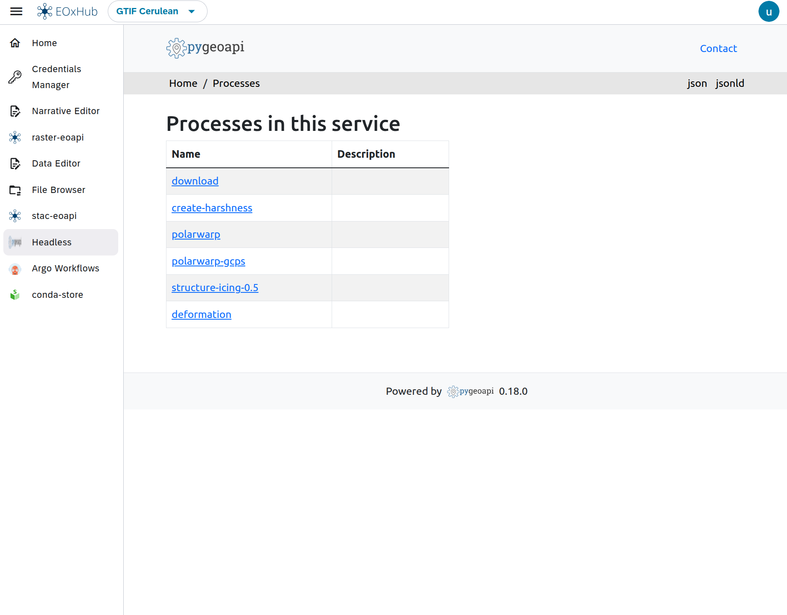
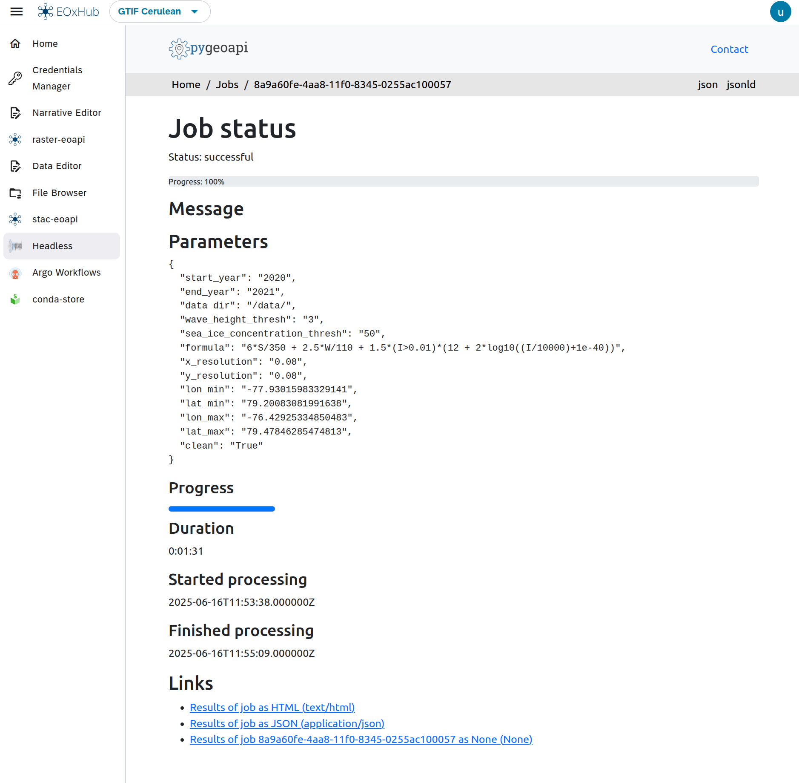

# Headless Execution

# Headless Execution in EDC

The **Headless Execution** feature in EOxHub Workspaces enables automated execution of Jupyter notebooks and Argo Workflows directly from the eodash dashboard or programmatically via API endpoints. It is designed for streamlined, reproducible, and user-friendly processing of Earth Observation tasks and workflows.



---

```{note} Like any other application the Headless Execution might not be available in your EOxHub Workspace. Contact your workspace admin to change this.
```

---

## What is Headless Execution?

Headless execution allows you to:

- Trigger processing jobs (e.g. notebooks, workflows) without manual interaction
- Run parameterized notebooks via API (e.g. different AOIs, time ranges, datasets)
- Connect dashboard buttons or UI elements directly to backend EO analysis pipelines
- Monitor job status and outputs centrally

It is particularly useful for:
- End-user-triggered tasks in EO dashboards
- Scheduled or batch analyses
- Lightweight data services

---

## Argo Workflows & pygeoapi Integration

EOxHub uses **pygeoapi** to expose Argo Workflows as standard OGC-compliant processes. This enables external tools or dashboards to:

- **Discover** available jobs and workflows
- **Submit** parameterized execution requests
- **Track** status and retrieve results

Each job has:
- A unique identifier and description
- A list of accepted parameters (e.g. AOI, date, dataset)
- Execution logs and outputs available via API or the EOxHub UI



---

## Triggering Notebook Jobs

In addition to workflows, parameterized **Jupyter notebooks** can also be exposed for headless execution. This allows notebooks to be reused as backend processors while preserving reproducibility and transparency.


---

## Monitoring and Managing Jobs

Once triggered, jobs can be tracked in the **Headless Execution** section of the workspace UI:

- View job queue and running/completed status
- Inspect input parameters and output previews
- Re-run or cancel jobs if needed



