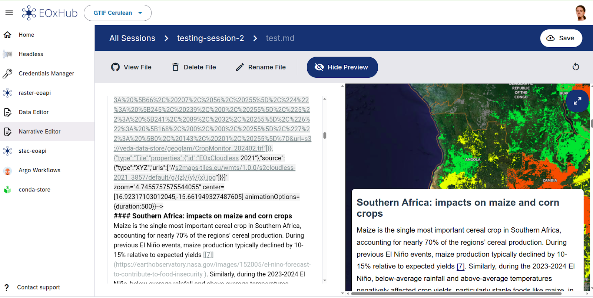

# Narrative Editor

The **Narrative Editor** is a collaborative, Git-based content editor for creating and publishing structured, markdown-driven narratives enriched with Earth Observation (EO) content. This documentation provides an overview of its architecture, key features, and user-facing functionality.

## Overview

Narrative Editor is based on [storytelling EOXElement](https://eox-a.github.io/EOxElements/?path=/story/elements-eox-storytelling--markdown-with-editor) and contains a preview renderer using markdown format with additional frontmatter definitions as a data source.

It integrates:

- Git-based workflow using [git-clerk](https://github.com/eoxgit/git-clerk) for content versioning and collaboration
- Scrollytelling and paginated rendering of narratives
- Live preview for story validation
- Support for interactive map tours

The editor is part of the EOxHub Workspaces and requires this feature to have enabled. 

--- 
## Key Features

### Git-Based Collaborative Editing
- Users authenticate with GitHub
- Forks and branches are created per editing session
- Users can review, comment, and approve stories through Pull Requests

### Story Rendering
- Live preview using the eye icon
- Supports both paginated and scroll-style rendering

### Map Integration
- Supports `eox-map` blocks
- Seamless storytelling with map transitions and animations
- Compatible with [EO Dashboard scrollytelling configuration](https://eodash.org/storytelling.html)

---

## Workflow Summary

1. **Start Session**: Create a new editing session connected to GitHub
2. **Create Narrative**: Define the title and initiate story structure
3. **Edit Content**: Use Markdown with embedded metadata, live preview supported
4. **Save and Review**: Save locally, then submit a GitHub PR for review
5. **Merge and Publish**: Approved narratives are merged and deployed to the official catalog

---

## Reference Tutorial

For detailed, visual step-by-step user instructions, please refer to:
➡️ [Creating a Narrative in the EOxHub Workspace (Scribe Tutorial)](https://scribehow.com/shared/Creating_a_Narrative_in_the_EOxHub_Workspace__OdlaaI1XRteoURL6uyIIqg)

This guide explains:
- How to authorize the editor via GitHub
- How to start a session and create a narrative
- Markdown editing, preview, and map integration
- Submitting stories for review and publishing

---

## GIT based flow

Narrative Editor application provides collaborative editting, review and approval system for narratives before being published in the corresponding repository. It is based on [git-clerk](https://github.com/EOX-A/git-clerk) - Open-Source Content Management System based on Git workflows with a friendly file-editing GUI.

The Markdown file is organized into story blocks and, if needed, further divided into individual steps within each section. Rendered stories can be displayed in either a paginated format or a scrollytelling mode.

A [demo story](https://eox-a.github.io/EOxElements/?path=/story/elements-eox-storytelling--markdown-with-editor) can be used to see most of the current functionality.

Additionally, existing stories such as those developed and published within the [ESA NASA, JAXA Earth Observing Dashboard](https://github.com/ESA-eodashboards/eodashboard-narratives) showcase the storytelling capabilities. 

A notable feature is the built-in integration with [eox-map](https://eox-a.github.io/EOxElements/?path=/docs/elements-eox-map--docs) element, which can be embedded as part of the story content. This allows for interactive map tours that smoothly transition between different areas or layers as users scroll through the story.

Narrative Editor interface 

For a more hands-on tutorial on how to publish insights by exposing data and creating a narrative, see chapter [**Publish Insights**](../use_cases/publish_insights.md)
[A reference to a header](#targeting-headers).

## Additional Resources

- [Storytelling Reference and Supported Features](https://eodash.org/storytelling.html)
- [Narrative Examples Repository](https://github.com/gtif-cerulean/cif-stories)
- [git-clerk GitHub Repository](https://github.com/eoxgit/git-clerk)

---

For development inquiries or integration support, please contact the EOX team.

