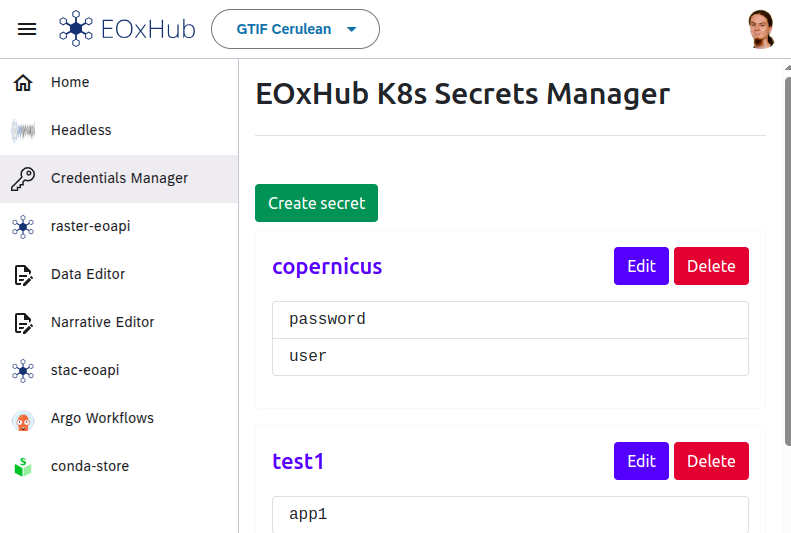

# Secrets Manager

Workspace secrets—such as API tokens, database credentials, or service keys—are securely managed using the **EOxHub Secrets Manager**. This tool ensures sensitive information is not hard-coded in notebooks, workflows, or shared files.



---

```{note} Like any other application the Secrets Manager might not be available in your EOxHub Workspace. Contact your workspace admin to change this.
```

## Key Features

- **Centralized and secure storage** of credentials for all workspace users  
- **Collaborative access**: All users within the workspace with correct roles can access and manage secrets  
- **Reusability**: Secrets can be reused across different applications (e.g., JupyterLab, Argo Workflows, data pipelines)

## Example Use Cases

- Accessing a **Sentinel Hub** instance or other APIs directly from JupyterLab  
- Supplying credentials to an **Argo Workflow** that fetches or publishes data to a cloud bucket  
- Configuring **private dataset access** within processing jobs


