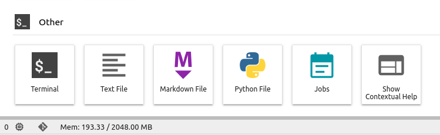
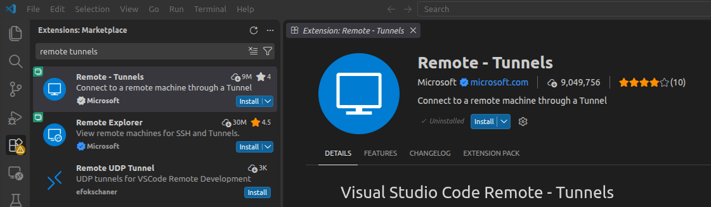

# VS Code Remote Tunnels

**Available through** [JupyterLab](jupyterlab.md)

[VS Code Remote Tunnels](https://code.visualstudio.com/docs/remote/tunnels) allow you to securely connect a local Visual Studio Code installation to your running JupyterLab workspace. This configuration lets you develop, run, and debug notebooks or scripts within your preferred local editor, while utilizing the high-performance computing resources and pre-configured Earth Observation libraries of your EOxHub Workspace.

---

## What are Remote Tunnels?

Instead of accessing JupyterLab solely through a web browser, Remote Tunnels establish a secure connection between your local computer and the containerized workspace environment. This approach offers several key benefits:

- **Local IDE Experience:** Access your custom VS Code settings, themes, shortcuts, and local extensions.
- **Rich Interactive Debugging:** Run, pause, and inspect variables in notebooks and Python scripts using the native VS Code interactive window and debugger.
- **Pre-Configured Environments:** Take advantage of the custom conda environments, kernels, and specialized Geospatial software running inside EOxHub without needing to configure them locally.

---

## Steps for using Remote Tunnels in EOxHub

Follow these steps to establish a secure tunnel connection between your local machine and your workspace.

### Step 1: Start your JupyterLab Workspace
Launch a JupyterLab session in your workspace. Select the **user profile** that matches your computing and memory requirements.

### Step 2: Open a Terminal in JupyterLab
Once JupyterLab is loaded, open a workspace terminal:
1. Click the **`+`** (Launcher) button in the upper-left of the main workspace interface.
2. Under the **Other** section, select **Terminal**.



### Step 3: Download and Start the VS Code CLI
In the JupyterLab terminal, download the VS Code CLI binary, extract it, and launch the tunnel service by running the following commands:

```bash
curl -sL "https://code.visualstudio.com/sha/download?build=stable&os=cli-alpine-x64" --output vscode-cli.tar.gz
tar -xf vscode-cli.tar.gz
./code tunnel
```

Once started:
1. The CLI will display the **Terms of Service**, accept them if prompted.
2. It will generate an authentication link (e.g., `https://github.com/login/device`) and an 8-character verification code.
3. Open the link in your web browser, enter the code, and sign in using your **GitHub** or **Microsoft** account to authorize the tunnel.

### Step 4: Install the Remote - Tunnels Extension in VS Code
On your **local machine**:
1. Open **Visual Studio Code**.
2. Navigate to the **Extensions** view (`Ctrl+Shift+X` or `Cmd+Shift+X`).
3. Search for and install the **Remote - Tunnels** extension.



### Step 5: Connect to the Workspace Tunnel
After installing the extension:
1. Click the green connection indicator button in the bottom-left corner of your local VS Code window (or open the Command Palette with `F1` or `Ctrl+Shift+P` and type `Remote-Tunnels: Connect to Tunnel...`).
2. Select **Connect to tunnel**.
3. Log in with the same account (e.g., **GitHub** or **Microsoft**) you used to authenticate the CLI in Step 3.
4. Select the detected tunnel session corresponding to your JupyterLab workspace.

VS Code will now connect directly to your EOxHub workspace. You can open folders, edit files, and launch notebooks with full access to the workspace file system and kernels.

---

## Reconnecting in Subsequent Sessions

One of the main benefits of this setup is that your configurations are persisted inside the workspace storage. For subsequent sessions:

1. Start your JupyterLab Workspace.
2. Open a terminal and start the tunnel again:
   ```bash
   ./code tunnel
   ```
3. Since your login information is kept on the disk, the tunnel will start immediately without requiring you to re-authenticate with GitHub/Microsoft.
4. Your local VS Code will automatically detect the tunnel and reconnect.

---

## Related documentation

- [JupyterLab](jupyterlab.md)
- [Example Notebooks](example_notebooks.md)
- [Conda Store](conda_store.md)
