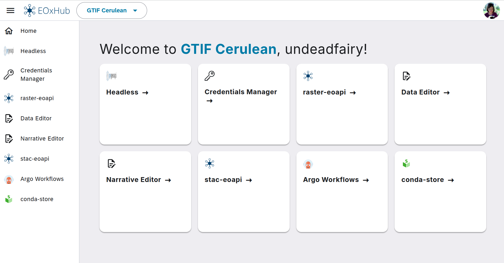

# Getting Started with EOxHub Workspaces

Welcome! This guide will walk you through the basic steps to start using EOxHub Workspaces.

---

## Sign Up

To use EOxHub Workspaces, all you need is a internet browser.

1. Go to [hub.eox.at](https://hub.eox.at) or navigate to URL of your workspace
2. Click **Register** button and follow the instructions
3. Confirm your email address
4. Wait for confirmation by your workspace manager 

Alternatively, use GitHub directly for registration for connecting your account.

## Log In

After your account has been approved, you can log in anytime.

1. Navigate to URL of your workspace
2. Use GitHub or email address and password and click **Sign In**

## Navigating the user area

After signing in, you should be able to see user area with tools available to your selected workspace. List of avaialble tools depends on workspace configuration and their respective documentations can be found in second chapter of this documentation. 

